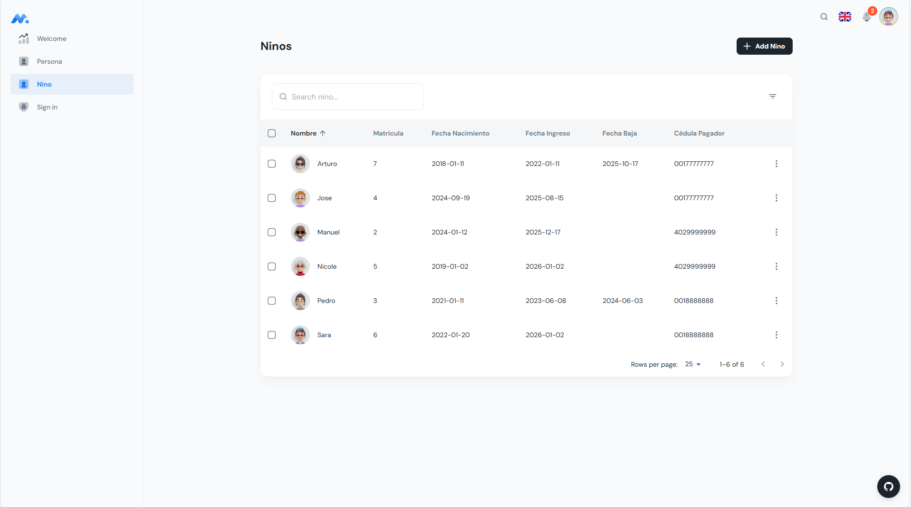

# 🏫 Kindergarten Management System


Un sistema integral para la gestión de guarderías, diseñado para administrar el registro de niños, pagos y personal. Desarrollado con una arquitectura moderna de microservicios contenerizados.

## 🚀 Características Principales

* **Gestión de Niños:** Altas, bajas y modificaciones con validaciones de integridad referencial.
* **Validaciones Robustas:** Backend con **FluentValidation** y feedback visual sincronizado en el Frontend.
* **Arquitectura Resiliente:** Manejo de errores centralizado y reconexión automática a base de datos.
* **Containerización:** Entorno totalmente Dockerizado (API, SQL Server, Nginx) con soporte para redes Linux (MTU fix).
* **Calidad de Código:** Tests de unidad y de integración con **Vitest** y **xUnit**.

## 🛠️ Tech Stack

* **Backend:** ASP.NET Core 9 (Minimal APIs), Entity Framework Core, SQL Server 2019.
* **Frontend:** React, TypeScript, Material UI (MUI), Vite, React Hook Form.
* **DevOps:** Docker Compose, GitHub Actions (CI), Nginx.

## 📸 Capturas de Pantalla

## Read


## Insert & Update


## ⚙️ Instalación y Ejecución

Puedes ejecutar este proyecto de dos formas:

### Opción A: Docker (Recomendada) 🐳
Requisito: Docker Desktop instalado.

1.  Clonar el repositorio:
    ```bash
    git clone [https://github.com/OmR-SC/kindergarten-api-dotnet-react.git](https://github.com/OmR-SC/kindergarten-api-dotnet-react.git)
    cd kindergarten-api-dotnet-react
    ```
2.  Configurar variables de entorno:
    ```bash
    cp .env.example .env
    # (Opcional) Edita .env si deseas cambiar la contraseña de la DB
    ```
3.  Levantar servicios:
    ```bash
    docker compose up --build
    ```
4.  Acceder:
    * **App:** http://localhost:3000
    * **Swagger API:** http://localhost:5214/swagger

### Opción B: Ejecución Manual 💻
Requisitos: .NET 9 SDK, Node.js v18+, SQL Server local.

**Backend:**
```bash
cd backend
dotnet user-secrets init
dotnet user-secrets set "ConnectionStrings:DefaultConnection" "Server=localhost;Database=KindergartenDB;Trusted_Connection=True;TrustServerCertificate=True;"
dotnet run
```
**Frontend:**

```bash
cd frontend
npm install
echo VITE_API_URL=http://localhost:5214 > .env
npm run dev
```

## 🧪 Testing
El proyecto cuenta con un pipeline de CI que ejecuta los tests automáticamente. Para correrlos localmente:

- Backend: dotnet test (desde la carpeta raíz)

- Frontend: npm run test:run (desde la carpeta frontend)

## 📄 Licencia
Este proyecto está bajo la Licencia MIT - ver el archivo LICENSE.md para más detalles.

## 👤 Autor
Omar (OmR-SC)

GitHub: https://github.com/OmR-SC

LinkedIn: https://www.linkedin.com/in/omarsanchezcuevas


